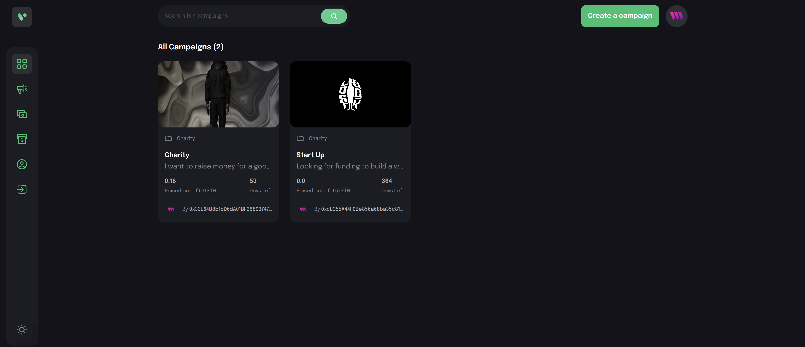
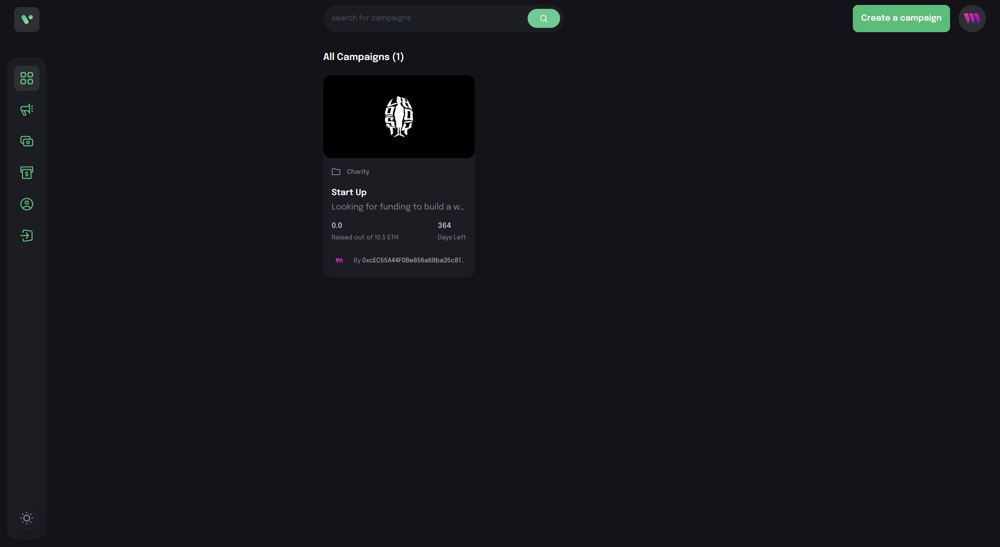
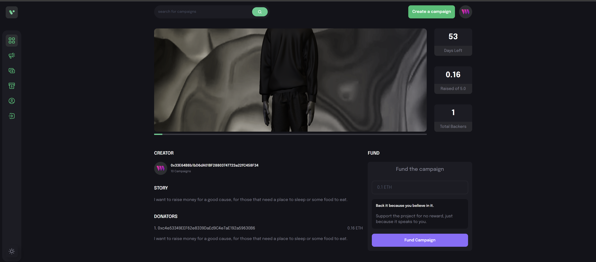
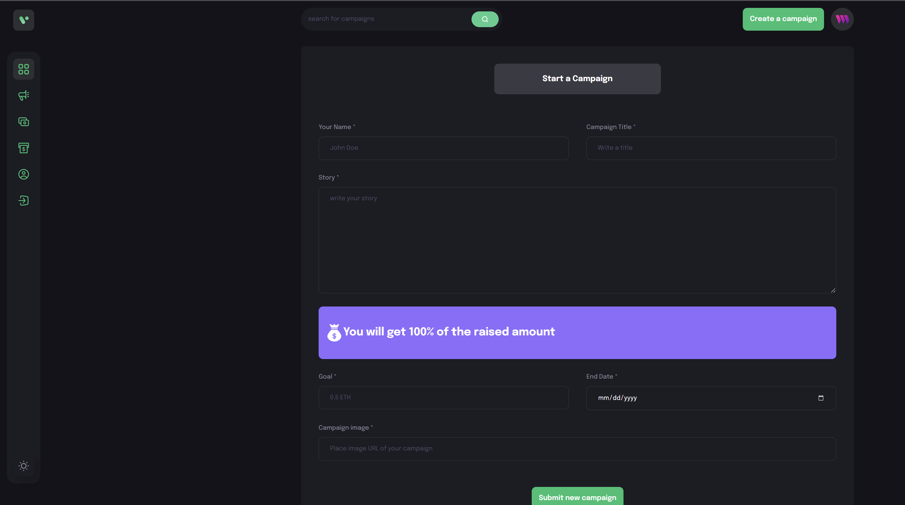

# Crowdfunding dApp

A web3 crowdfunding dApp

---

 

[ABOUT](#about) •
[INSTALLATION](#installation) •
[DEMO](#demo) •
[TECH STACK](#tech-stack) •
[CONTACT ME](#contact-me)

 

## About

A dApp where users can connect their metamask wallets, create their own crowdfunding campaigns and donate to other peoples' campaigns. The app interacts with a smart contract deployed on the Goerli test network to create a campaign, donate to a campaign, get campaigns and get donators.

 

## Installation

- Download or clone the repository.
- Open the application using a CLI,
- Open the web3 folder run `npm i`
- Create an env file, copy your metamask private key and save it in the file
- Make sure you are connected to the Goerli test net and you have goerli ETH in your wallet
- Make sure you are using your account in the hardhat.config file
- run `npm run deploy` to deploy the smart contract
- Open your client folder and run `npm i`
- Paste your deployed contract address in the context
- `npm run dev`

## Demo

 

## Tech Stack

 
 

## Contact Me

If you have any questions or you are looking to collaborate on any web3 projects, please reach out to me at [youssef.ojeil@gmail.com](mailto:youssef.ojeil@gmail.com).

 
